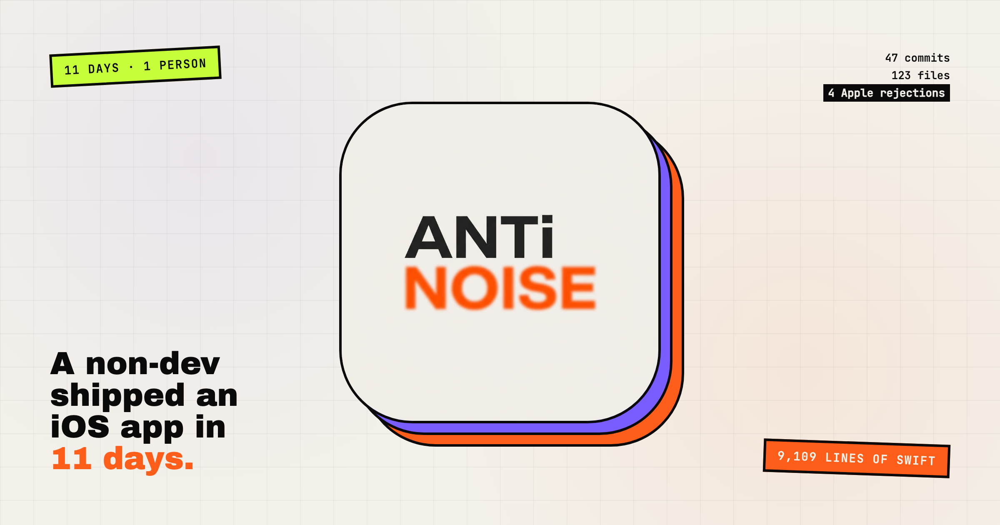
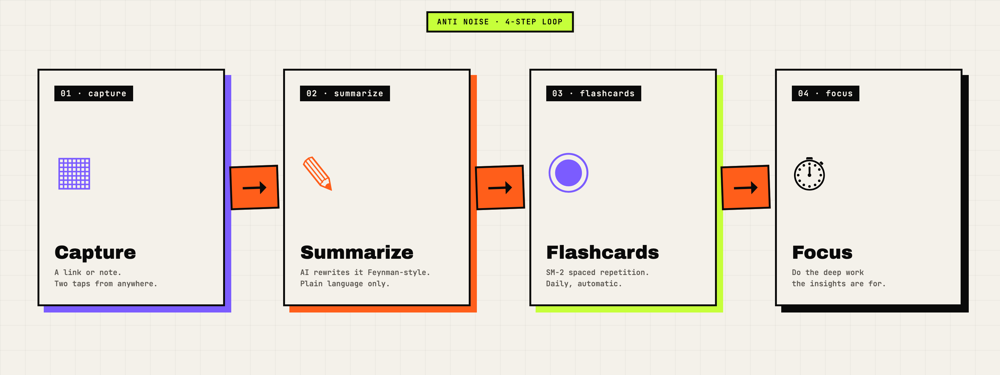
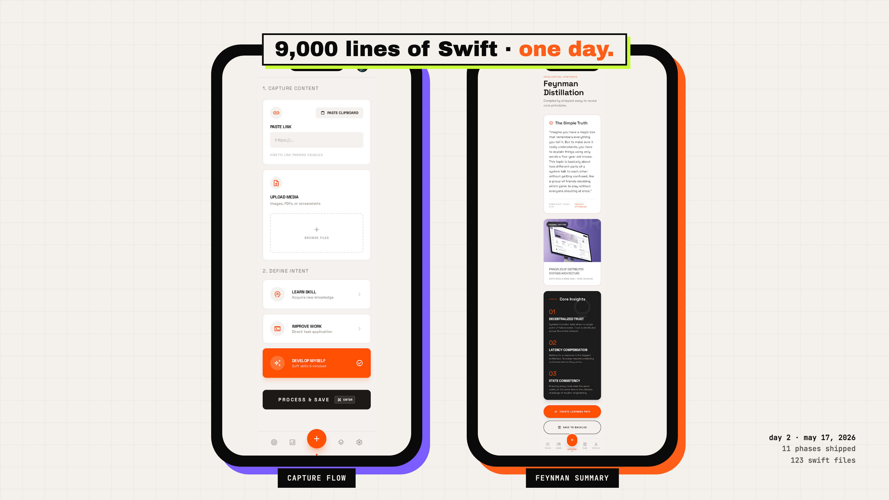
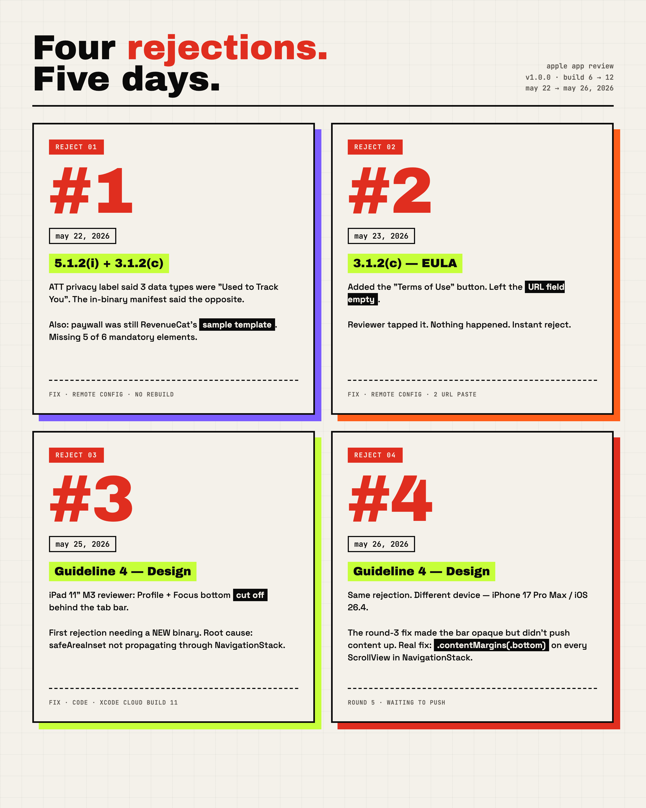
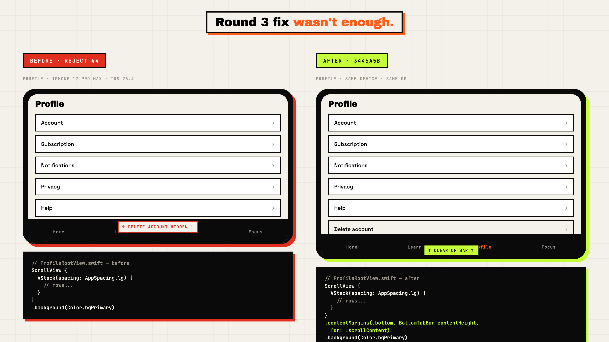
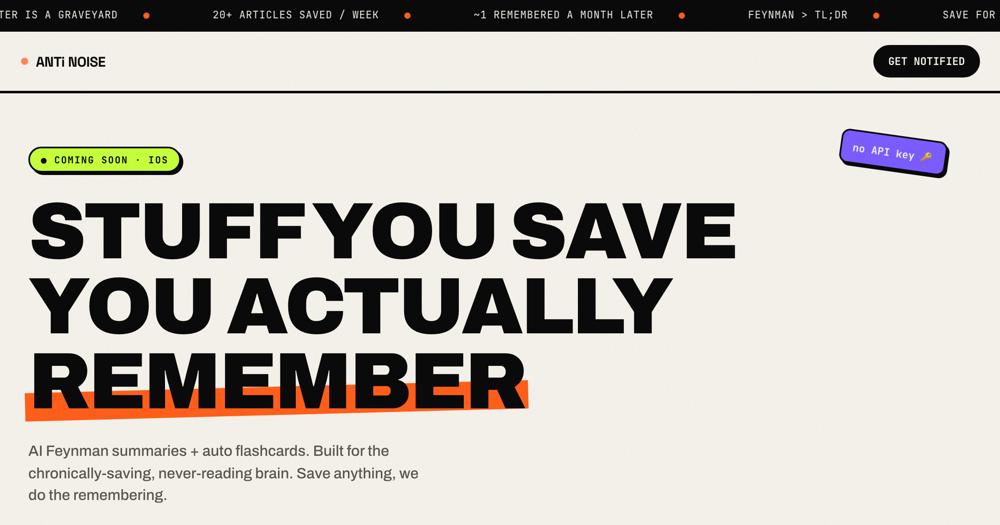

# I shipped an iOS app in 11 days. I don't know how to code.

I'm not a developer. I'd never opened Xcode. I don't know what a provisioning profile is.

On May 16, 2026, I started building an iOS app called **Anti Noise: Focus & Learn**. Eleven days later, it was in App Review at Apple. This is the honest log.

---

## The idea

Knowledge workers read 30 articles a week and remember zero. We capture, we don't retain.

So: capture short insights → AI turns them into Feynman-style explanations → those become spaced-repetition flashcards → a focus timer lives in the same app to actually do deep work.

Five surfaces. Solo. Non-tech. Ten-day calendar.

---

## Day 1–2: the part that should have taken a month

I gave the AI a one-page spec and a stack: SwiftUI, Firebase Auth, RevenueCat, OpenAI. It broke the work into 12 phases.

Day 1: scaffolding, 5 hours.

Day 2: from 9 AM to 9 PM, the AI wrote **~9,000 lines of Swift across 123 files** — sign-in, onboarding, capture, summarizer, flashcard engine, focus timer, profile, stats, privacy manifest.

I didn't write any of it. I read the diffs, ran the app, clicked through every screen. Caught two real bugs and described them; the AI fixed both in under five minutes each.

By 9 PM I had a working app on the simulator. End to end.

---

## Day 3–5: the world outside the code

The code is maybe 40% of shipping an app. The other 60% is configuration across Firebase, RevenueCat, Apple Developer, App Store Connect, Xcode Cloud — about 17 separate console screens.

Privacy nutrition labels (8 data types, must match the in-binary manifest exactly). Two subscription SKUs, localized EN + VI. RevenueCat offering linked to the right entitlement. Privacy policy hosted on GitHub Pages because Apple won't take a Notion link.

Every console click → another question to AI. About 200 small questions in 3 days.

May 20: first Submit for Review.

---

## Four rejections

**Reject #1 (May 22).** ATT privacy mismatch + my paywall was still RevenueCat's sample template titled "Mindful moments." Apple wants six things on a paywall — I had two. Fixed remotely, no rebuild.

**Reject #2 (May 23).** I'd added a "Terms of Use" button but left the URL field empty. Reviewer tapped it, nothing happened. Also needed the EULA URL pasted into App Description. Two URLs added.

**Reject #3 (May 25).** First rejection that needed a new binary. iPad reviewer saw Profile + Focus cut off behind the tab bar. AI traced it: `safeAreaInset(.bottom)` doesn't propagate through `NavigationStack`. Wrote a fix, built via Xcode Cloud, resubmitted.

**Reject #4 (May 26).** Same rejection, different device. The round-3 fix made the bar opaque but didn't push content up. Real fix: `.contentMargins(.bottom, 52, for: .scrollContent)` on every ScrollView inside a NavigationStack. Build for round 5 ready to push.

---

## The receipts

- **11 days** from empty folder to App Store submission
- **47 commits**, **9,109 lines of Swift**, **123 files**
- **~55 hours** at the keyboard, talking to AI
- **12 different AI agents/specialists** (planner, coder, debugger, code-reviewer, designer, doc-writer, and more)
- **4 Apple rejections, 1 person, 0 lines of Swift written by hand**

---

The app isn't live yet. It might get rejected a fifth time. That's fine.

**The hard part wasn't the code.** The code happened in two days. The hard part was 17 consoles, 8 Apple guidelines, 4 rejections, and a structural SwiftUI bug I'd never heard of.

None of that is *knowing how to code*. All of it is *knowing what to ask for and recognizing what you see.*

Which is a thing non-developers can absolutely do.

