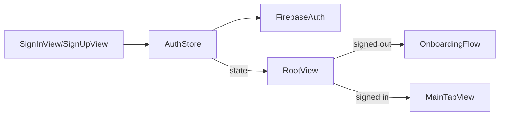

# Phase 03 — Firebase Auth (Email + Apple)

## Context Links
- Parent: [plan.md](./plan.md)
- Deps: phase-01, phase-02
- Mockups: `Product UI/import_profile/screen.png`, `Product UI/anti_noise_landing_page_updated_hero/screen.png`

## Overview
- Date: 2026-05-16
- Description: Firebase Auth integration with email/password + Sign in with Apple. Session persistence, sign-out, account deletion stub.
- Priority: P0 (gates user-bound features)
- Implementation status: pending
- Review status: pending
- Effort: 1.5d

## Key Insights
- Auth providers are LOCKED: Email/password + Sign in with Apple ONLY. No Google, no Facebook, no SMS/phone, no anonymous.
- Apple requires Sign in with Apple if any third-party social auth ships; ours stays clean since Apple is the only social provider.
- Firebase Auth state is observable via `addStateDidChangeListener`. Wrap in `@Observable` `AuthStore`.
- Apple Sign-In nonce: client generates random `String` (32 bytes), SHA256-hash sent as `rawNonce` to `ASAuthorizationAppleIDRequest`, raw value sent to Firebase via `OAuthProvider.credential(withProviderID: "apple.com", idToken:, rawNonce:)`. Mismatch → Firebase rejects.
- Account deletion is App Store requirement (Guideline 5.1.1(v)) — full flow (export + 7-day grace) implemented in phase-10; phase-03 exposes the API on `AuthStore` only.

## Requirements
**Functional**
- Sign up + sign in via email/password.
- Sign in with Apple (ASAuthorizationAppleIDProvider) with SHA256 nonce hashing.
- No other providers exposed in UI (no Google button, no SMS).
- Persisted session across launches.
- Sign out flushes local SwiftData user-scoped data.
- Delete account API surfaced on `AuthStore.deleteAccount()`; UI flow + grace handled in phase-10.

**Non-functional**
- Auth UI must not block main thread.
- Errors surfaced as `AppEmptyState`/inline messages, never raw Firebase strings.

## Architecture

Data flow:
- App launch → `AuthStore.bootstrap()` → emits `.signedOut | .signedIn(User)`.
- `RootView` switches stack accordingly.

## Related Code Files (to create)
- `AntiNoise/Core/Services/Auth/AuthStore.swift` (`@Observable`)
- `AntiNoise/Core/Services/Auth/AppleSignInCoordinator.swift`
- `AntiNoise/Core/Services/Auth/AuthError.swift`
- `AntiNoise/Core/Models/AppUser.swift` (Codable, derived from FirebaseUser)
- `AntiNoise/Features/Auth/Views/SignInView.swift`
- `AntiNoise/Features/Auth/Views/SignUpView.swift`
- `AntiNoise/Features/Auth/Views/AuthLandingView.swift`
- `AntiNoise/Features/Onboarding/OnboardingFlowView.swift` (maps to `import_profile` mockup)
- `AntiNoise/App/RootView.swift` (update from phase-01)

## Implementation Steps
1. Add `GoogleService-Info.plist` (gitignored; commit `.example`).
2. `FirebaseApp.configure()` in `AntiNoiseApp.init`.
3. Enable "Sign in with Apple" capability.
4. Build `AuthStore` with `currentUser: AppUser?`, `state: AuthState`, methods `signIn`, `signUp`, `signInWithApple`, `signOut`, `deleteAccount`.
5. `AppleSignInCoordinator` handles nonce: (a) generate `randomNonceString(length: 32)` (alphanumeric); (b) compute `sha256(nonce)` → set as `request.nonce`; (c) on success, pass `idTokenString` + raw `nonce` to `OAuthProvider.credential(...)` → `Auth.auth().signIn(with: credential)`. Store raw nonce in coordinator instance, NOT UserDefaults.
6. `AuthLandingView` (logo + "Continue with Apple" + "Continue with Email") mirrors `anti_noise_landing_page_updated_hero` mockup. No other social buttons.
7. `SignInView` / `SignUpView` with email + password fields (`AppTextField`).
8. `OnboardingFlowView` collects display name + classification scopes hint (Personal/Work/Business) — used by phase 07.
9. Wire `RootView` to switch on `AuthStore.state`.
10. Persistence: Firebase auto-persists. No keychain work needed.
11. QA: kill app + relaunch → still signed in.

## Todo
- [ ] GoogleService-Info.plist wired (gitignored)
- [ ] Apple Sign-In capability enabled
- [ ] AuthStore implemented
- [ ] Apple Sign-In coordinator
- [ ] AuthLandingView matches mockup
- [ ] SignInView + SignUpView
- [ ] OnboardingFlowView collects scopes
- [ ] RootView routes by auth state
- [ ] Sign-out flow tested
- [ ] Delete-account stub present

## Success Criteria
- Cold-launch with no session → AuthLanding.
- Email sign-up + sign-in works; user persists across launches.
- Apple Sign-In works on real device.
- Sign-out returns to AuthLanding immediately.

## Risk Assessment
- **R1**: Apple Sign-In nonce mishandling. → Use Firebase official sample for SHA256 nonce hashing. Unit-test the hex-encoding of SHA256 output.
- **R2**: Test accounts blocked by App Review. → Provide demo account credentials in App Store Connect (phase 12).
- **R3**: User signed in with Apple revokes access from iOS Settings → token invalid. → Detect on next `signInState` refresh, surface re-auth prompt, do NOT auto-create new account.

## Security Considerations
- Never log auth tokens.
- Email/password validated (min 8 chars, valid email) client-side; Firebase enforces server-side.
- Delete account must purge: Firestore docs, SwiftData store, Keychain entries, RevenueCat alias (phase 11).

## Next Steps
- Phase 04 (tab shell) consumes signed-in state.
- Phase 11 (RevenueCat) aliases Firebase UID.
