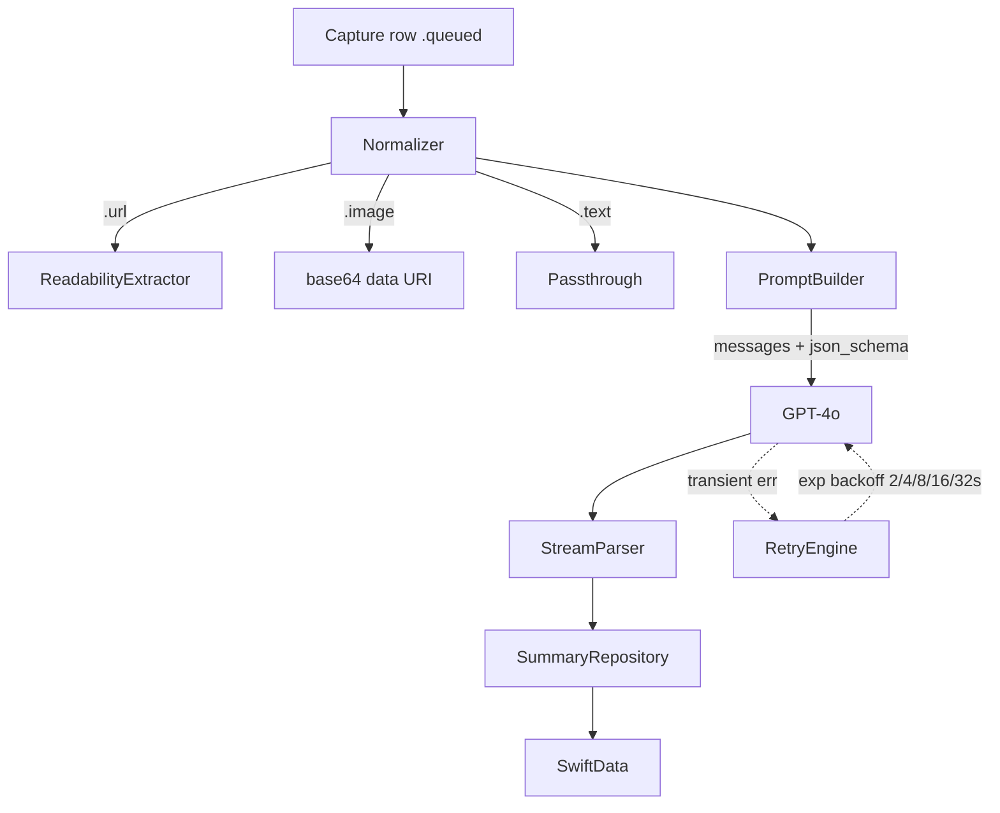

# Phase 06 — AI Feynman Summary (OpenAI)

## Context Links
- Parent: [plan.md](./plan.md)
- Deps: phase-05 (Capture rows), phase-03 (user identity for usage attribution)
- Mockups: `Product UI/anti_noise_feynman_insight_distillation/screen.png`, `Product UI/ai_connection_anti_noise/screen.png`
- Spec: Feynman quick summary explicitly listed in `.docx`

## Overview
- Date: 2026-05-16
- Description: Pipeline that takes a `Capture` row, normalizes content (URL → readability text, image → GPT-4o vision multimodal input, text passthrough), calls OpenAI GPT-4o to produce a 5-section Feynman-method summary, persists `Summary`. Offline-aware with retry policy.
- Priority: P0
- Implementation status: pending
- Review status: pending
- Effort: 2d

## Key Insights
- Model LOCKED: OpenAI `gpt-4o` (chat completions) with `response_format = { type: "json_schema", ... }` for strict structured output. No Vision OCR fallback, no model fallback.
- Image inputs: send directly as multimodal message content `{ "type": "image_url", "image_url": { "url": "data:image/jpeg;base64,..." } }`. No on-device pre-OCR.
- Feynman schema LOCKED with 5 sections: `simple_explanation`, `analogy`, `knowledge_gaps`, `examples`, `deeper_question`.
- API key handling: client-side OpenAI key is risky. MVP ships with on-device key in Keychain; v1.1 introduces server proxy.
- URL content extraction: avoid full HTML-to-LLM. SwiftSoup + heuristic; fall back to URL + title + OG meta if extraction empty.
- Offline retry LOCKED: exponential backoff `2s, 4s, 8s, 16s, 32s` (5 attempts max). Between attempts, check reachability. After 5 attempts → `.failed` with stored `errorMessage`; user can manually retry from SummaryDetailView.

## Requirements
**Functional**
- For `kind == .url`: fetch HTML → SwiftSoup extract title + main text → send as text part to GPT-4o.
- For `kind == .image`: send image directly via GPT-4o vision multimodal `image_url` part (base64 data URI). No on-device OCR.
- For `kind == .text`: send raw text directly.
- Output `Summary { simpleExplanation, analogy, knowledgeGaps[String], examples[String], deeperQuestion, suggestedClassification: ClassificationScope, recommendedDeepDive: Bool, generatedAt }`.
- Retry on transient failure: 5 attempts, exponential backoff `2s/4s/8s/16s/32s`, gated by reachability.
- Stream output to UI when possible (`text/event-stream`).

**Non-functional**
- p50 latency ≤ 6s end-to-end for a 1k-word article (online).
- Token budget per summary ≤ 1500 output tokens.

## Architecture


### Locked JSON schema (sent as `response_format.json_schema.schema`)

```jsonc
{
  "type": "object",
  "required": ["simple_explanation", "analogy", "knowledge_gaps", "examples", "deeper_question", "suggested_classification", "recommend_deep_dive"],
  "properties": {
    "simple_explanation": { "type": "string", "description": "Explain like to a 12-year-old. 2-4 sentences." },
    "analogy":            { "type": "string", "description": "One concrete analogy that maps the core idea to everyday life." },
    "knowledge_gaps":     { "type": "array", "items": { "type": "string" }, "description": "What the source assumes but doesn't explain. 2-5 items." },
    "examples":           { "type": "array", "items": { "type": "string" }, "description": "Concrete examples that ground the idea. 2-4 items." },
    "deeper_question":    { "type": "string", "description": "One follow-up question that pushes understanding further." },
    "suggested_classification": { "type": "string", "enum": ["personal", "work", "business"] },
    "recommend_deep_dive":      { "type": "boolean" }
  },
  "additionalProperties": false
}
```

### Swift Codable mirror

```swift
struct FeynmanSummaryPayload: Codable {
  let simpleExplanation: String
  let analogy: String
  let knowledgeGaps: [String]
  let examples: [String]
  let deeperQuestion: String
  let suggestedClassification: ClassificationScope  // .personal / .work / .business
  let recommendDeepDive: Bool

  enum CodingKeys: String, CodingKey {
    case simpleExplanation       = "simple_explanation"
    case analogy
    case knowledgeGaps           = "knowledge_gaps"
    case examples
    case deeperQuestion          = "deeper_question"
    case suggestedClassification = "suggested_classification"
    case recommendDeepDive       = "recommend_deep_dive"
  }
}
```

## Related Code Files (to create)
- `AntiNoise/Core/Models/Summary.swift` (`@Model`, related to Capture)
- `AntiNoise/Core/Models/KeyTerm.swift`
- `AntiNoise/Core/Models/ClassificationScope.swift` (personal/work/business — also used phase-07)
- `AntiNoise/Core/Networking/OpenAIClient.swift`
- `AntiNoise/Core/Networking/SSEDecoder.swift`
- `AntiNoise/Core/Services/AI/PromptBuilder.swift`
- `AntiNoise/Core/Services/AI/FeynmanPrompt.swift` (system + few-shot examples)
- `AntiNoise/Core/Services/AI/CaptureNormalizer.swift`
- `AntiNoise/Core/Services/AI/ReadabilityExtractor.swift`
- `AntiNoise/Core/Services/AI/ImageEncoder.swift` (downscale + base64 data-URI for GPT-4o vision input)
- `AntiNoise/Core/Services/AI/AISummarizer.swift` (orchestrator)
- `AntiNoise/Core/Services/AI/AIRetryEngine.swift` (5 attempts, exp backoff 2/4/8/16/32s, reachability-gated)
- `AntiNoise/Core/Services/AI/AIUsageTracker.swift` (monthly counter for free tier; feeds phase-11)
- `AntiNoise/Core/Services/Secrets/SecretStore.swift` (Keychain)
- `AntiNoise/Features/Capture/Views/SummaryDetailView.swift` (renders `anti_noise_feynman_insight_distillation`)
- `AntiNoise/Features/Capture/ViewModels/SummaryDetailModel.swift`

## Implementation Steps
1. Define `Summary` `@Model` with one-to-one `Capture` relation.
2. `SecretStore` reads OpenAI API key from Keychain; bootstrap from Info.plist build setting (debug) or RevenueCat-issued token (release plan).
3. `OpenAIClient.chatCompletion(stream:)` using URLSession `bytes(for:)`.
4. `FeynmanPrompt` system prompt: pins the 5-section schema, language-mirroring rule ("respond in same language as input"), and Feynman pedagogy guardrails (no jargon, 12-year-old reading level). Request `response_format: { type: "json_schema", json_schema: { name: "feynman_summary", strict: true, schema: <see above> } }`.
5. `PromptBuilder` injects normalized text (or image part) + scope hint from onboarding (phase-03).
6. `ReadabilityExtractor`: SwiftSoup port or simple heuristic (longest `<article>` / `<main>` text, fallback to `<title>` + meta description).
7. Image input: `ImageEncoder.encode(_:)` downsizes to 1024px long edge max, JPEG q=0.8, base64-encodes, formats as `data:image/jpeg;base64,...` and packs into a `{"type":"image_url"}` content part.
8. `AISummarizer.process(capture:)`:
   - Set capture.status = .processing
   - Normalize → build prompt → stream
   - Parse JSON via `FeynmanSummaryPayload` → persist `Summary`
   - capture.status = .summarized
   - On transient err → hand to `AIRetryEngine` (5 attempts, exp backoff 2/4/8/16/32s, abort if offline)
   - On final failure → status = .failed, store `errorMessage`
9. `AIUsageTracker` logs each successful summary into a monthly counter (`monthlyAISummaryCount` keyed by `YYYY-MM`); phase-11 reads this for the 5/mo free cap.
10. `SummaryDetailView` renders the 5 sections (Simple explanation, Analogy, Knowledge gaps, Examples, Deeper question); CTA: "Deep dive" (→ phase-08) or "Archive". Manual retry button when `status == .failed`.

## Todo
- [ ] Summary model with 5 sections (simpleExplanation/analogy/knowledgeGaps/examples/deeperQuestion)
- [ ] OpenAIClient with SSE streaming, pinned to `gpt-4o`
- [ ] FeynmanPrompt (system) + json_schema strict response_format
- [ ] FeynmanSummaryPayload Codable
- [ ] ReadabilityExtractor for URLs
- [ ] ImageEncoder for GPT-4o vision input (no on-device OCR)
- [ ] AISummarizer orchestrator
- [ ] AIRetryEngine (5 attempts, exp backoff 2/4/8/16/32s, reachability-gated)
- [ ] AIUsageTracker monthly counter (feeds phase-11)
- [ ] SummaryDetailView renders 5 sections
- [ ] Streaming UI updates while summary generates
- [ ] Failure → manual retry CTA

## Success Criteria
- Capture URL → 6s later, 5-section summary visible in Learn tab.
- Capture image → image sent to GPT-4o vision directly → 5-section summary returned.
- API key revoked → UI shows clear error, not crash.
- Streaming text appears progressively in SummaryDetailView.
- Offline at capture time → row stays `.queued`; flip online → AISummarizer drives row to `.summarized` within 5 attempts.
- Malformed JSON from model (rare with strict schema) → row to `.failed`, retry CTA visible.

## Risk Assessment
- **R1**: API key embedded in IPA is extractable. → Document as known MVP risk; v1.1 introduces server proxy or RC entitlement-issued JWT.
- **R2**: Long articles exceed context window. → Pre-truncate to ~6k tokens; mention truncation in summary footer.
- **R3**: Non-English content. → Prompt instructs "respond in same language as input"; Vietnamese supported natively by GPT-4o.
- **R4**: Image with no text content (e.g., a meme) → model returns generic. → Acceptable for MVP; surface as low-value summary, do not error.
- **R5**: Pure-image capture stuck offline indefinitely. → After 5 backoff attempts, row to `.failed`; user can manually retry once back online.

## Security Considerations
- Keychain for API key (kSecAttrAccessibleAfterFirstUnlockThisDeviceOnly).
- Strip image EXIF before OCR / vision upload (already done phase-05).
- Don't log full prompts / responses in production builds.

## Next Steps
- Phase-07 consumes `Summary.suggestedClassification`.
- Phase-08 generates flash cards from `Summary` when user taps "Deep dive".
