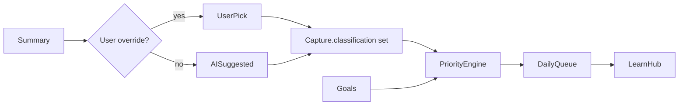

# Phase 07 — Classification + Daily Priority Engine

## Context Links
- Parent: [plan.md](./plan.md)
- Deps: phase-06 (Summary with suggestedClassification)
- Mockups: `Product UI/career_goals_anti_noise/screen.png`, `Product UI/simplified_learn_hub_anti_noise/screen.png`
- Spec: "Hệ thống phân loại - Personal / Work / Business" + "Hệ thống ưu tiên task học mỗi ngày"

## Overview
- Date: 2026-05-16
- Description: Categorize each summary into one of 3 fixed scopes (Personal Dev / Work Dev / Business Dev) — set is LOCKED, no custom categories in MVP. Daily priority engine surfaces top N items to learn today based on user goals, recency, and urgency.
- Priority: P1
- Implementation status: pending
- Review status: pending
- Effort: 2d

## Key Insights
- Categories LOCKED: `personal` (Personal Dev), `work` (Work Dev), `business` (Business Dev). Modeled as a fixed Swift enum, no user-defined categories in MVP.
- User-set goals per scope (e.g., "Personal: become better Swift dev") provide weighting context for priority scoring.
- Priority is computed locally — no AI call needed daily. Cheap, fast, deterministic.
- "Daily" resets at user-local midnight; carry-over of skipped items until archived.

## Requirements
**Functional**
- User picks 1–3 goals per scope (`career_goals_anti_noise` mockup).
- Each `Summary` auto-classified by AI; user can re-classify.
- `DailyPriorityEngine.computeQueue(date:)` returns ordered `[CaptureRef]` for that day, capped at user-configurable count (default 5).
- Learn tab surfaces today's queue + "All inbox" + "By scope" tabs.

**Non-functional**
- Queue computation < 50ms over 1000 captures.
- Re-classification is one tap (chip swap).

## Architecture


Scoring formula (initial):
```
score = w_recency * recencyFactor      // newer = higher
      + w_scopeAlignment * goalMatch   // 0..1 based on overlap with user's goals
      + w_deepDive * recommendDeepDive // 0 or 1 from AI
      - w_skips * skipCount            // discourage repeatedly skipped
```
Weights tunable in `PriorityWeights.swift`.

## Related Code Files (to create)
- `AntiNoise/Core/Models/LearningGoal.swift` (`@Model`, fields: scope, title, createdAt)
- `AntiNoise/Core/Models/ClassificationScope.swift` (extended from phase-06)
- `AntiNoise/Core/Services/Classification/ClassificationRepository.swift`
- `AntiNoise/Core/Services/Priority/DailyPriorityEngine.swift`
- `AntiNoise/Core/Services/Priority/PriorityWeights.swift`
- `AntiNoise/Core/Services/Priority/PriorityScorer.swift`
- `AntiNoise/Features/Onboarding/GoalSetupView.swift` (mirrors `career_goals_anti_noise`)
- `AntiNoise/Features/Learn/LearnHubView.swift` (replaces phase-04 placeholder)
- `AntiNoise/Features/Learn/Views/DailyQueueSection.swift`
- `AntiNoise/Features/Learn/Views/InboxListView.swift`
- `AntiNoise/Features/Learn/Views/ScopeFilterChips.swift`
- `AntiNoise/Features/Learn/ViewModels/LearnHubModel.swift`

## Implementation Steps
1. Extend `ClassificationScope` enum (3 fixed cases: `personal`, `work`, `business`) with localized labels in `Localizable.xcstrings` (VI + EN per phase-12).
2. `LearningGoal` model + CRUD in Profile (phase-10) and onboarding.
3. `GoalSetupView` in onboarding lets user add ≤3 goals per scope.
4. Classification chip on summary card → tap → bottom-sheet to override scope.
5. `PriorityScorer.score(capture:goals:now:)` returns `Double`.
6. `DailyPriorityEngine.computeQueue(for: Date, max: Int)`:
   - Filter captures `status == .summarized`, not archived, not in today's "done" set.
   - Score each, sort desc, take `max`.
   - Cache result keyed by `date.startOfDay` to avoid re-compute on tab re-entry.
7. `LearnHubView`: today's queue card stack + inbox tab + scope filter chips. Matches `simplified_learn_hub_anti_noise`.
8. "Mark done" / "Skip" on a queue item updates `skipCount` or `completedAt`.
9. Daily reset at local midnight via `Calendar.startOfDay`.

## Todo
- [ ] LearningGoal model + CRUD
- [ ] GoalSetupView in onboarding
- [ ] ClassificationScope override UI on summary
- [ ] PriorityScorer with tunable weights
- [ ] DailyPriorityEngine with caching
- [ ] LearnHubView matches mockup
- [ ] Mark-done / skip wired to model
- [ ] Midnight reset verified

## Success Criteria
- Add 10 captures → today's queue shows top 5 ordered by score.
- Skipping an item lowers its priority next day.
- Re-classification persists across launches.

## Risk Assessment
- **R1**: AI mis-classification too frequent → user fatigue. → Show suggested chip with "✓ accept / change" affordance, not auto-commit silently.
- **R2**: Weight tuning is voodoo. → Ship sensible defaults + hidden debug screen to tune (phase-12).

## Security Considerations
- Goals + classification are user-personal; never share off-device without explicit export.

## Next Steps
- Phase-08 (flash cards) is invoked when user taps "Deep dive" on a queue item.
- Phase-10 Profile shows progress per scope.
