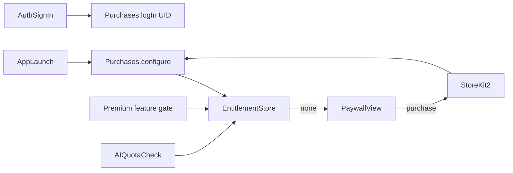

# Phase 11 — RevenueCat Paywall + Subscription Gating

## Context Links
- Parent: [plan.md](./plan.md)
- Deps: phase-03 (user id alias), phase-06 (AI usage tracking), phase-08 (cards limit)
- Mockups: none provided — use RevenueCat's prebuilt paywall template OR design from `anti_noise_landing_page_updated_hero` style
- Tier model + triggers LOCKED (see plan.md Resolved Decisions §1, §3)

## Overview
- Date: 2026-05-16
- Description: Integrate RevenueCat SDK, set up entitlements/offerings, build paywall UI, gate premium features (AI quota, advanced focus, unlimited decks).
- Priority: P1
- Implementation status: pending
- Review status: pending
- Effort: 1.5d

## Key Insights
- Apple requires StoreKit transactions stay on-device; RevenueCat is a thin abstraction + entitlement server. App still uses StoreKit 2 under the hood.
- Use RevenueCat's `PaywallView` (SwiftUI) where possible to skip custom paywall design for MVP.
- Alias RC `appUserId` to Firebase UID for cross-device entitlement consistency.
- Trial LOCKED: 7-day Pro trial as Apple intro offer attached to the monthly Pro product. Auto-grant on first launch by checking `customerInfo.firstSeen` + no prior subscription state — call `Purchases.shared.syncPurchases()` then start trial via App Store Connect's intro offer eligibility. RC handles the rest.
- Triggers LOCKED (NO onboarding paywall, NO post-onboarding hard wall):
  - **Trial expiry**: when `customerInfo.entitlements["pro"].isActive == false` AND `firstSeen + 7d < now` AND user never converted → on next foreground, present `TrialExpirySheet`.
  - **Quota hit**: when `UsageQuotaService.canConsume(.capture)` or `.aiSummary` returns false on a free user action → present `QuotaHitSheet` inline.
- Free tier LOCKED: 3 captures/day + 5 AI summaries/month. Pro: unlimited both.

## Requirements
**Functional**
- **Free tier**: 3 captures/day + 5 AI summaries/month. All other features (decks, focus, etc.) unlimited.
- **Pro**: unlimited captures, unlimited AI summaries. (Monthly + annual SKUs; trial offer attached to monthly.)
- **7-day Pro trial** on first launch, auto-activated (Apple intro offer eligibility).
- Paywall triggers:
  1. Trial-expiry sheet (presented on foreground after trial ends + user did not convert)
  2. Quota-hit sheet (4th capture in a day, OR 6th AI summary in a month)
  3. Profile "Upgrade" row (passive entry point, always available)
- NO onboarding paywall. NO post-onboarding hard wall.
- Restore purchases supported.

**Quota counters**
- `dailyCaptureCount` keyed by `YYYY-MM-DD` in local time
- `monthlyAISummaryCount` keyed by `YYYY-MM` in local time
- Reset implicitly by date-key change; no explicit cron needed.

**Non-functional**
- Paywall load < 1s on 4G.
- Entitlement check is local-first (cached), syncs in background.

## Architecture

## Related Code Files (to create)
- `AntiNoise/Core/Services/Subscription/SubscriptionStore.swift` (`@Observable`)
- `AntiNoise/Core/Services/Subscription/EntitlementGate.swift` (helper: `requirePro(_ feature:) -> Bool`)
- `AntiNoise/Core/Services/Subscription/UsageQuotaService.swift` (free tier counters)
- `AntiNoise/Features/Paywall/PaywallSheetView.swift` (wraps RevenueCatUI `PaywallView`)
- `AntiNoise/Features/Paywall/TrialExpirySheet.swift`
- `AntiNoise/Features/Paywall/QuotaHitSheet.swift` (variants: capture vs aiSummary)
- `AntiNoise/Features/Paywall/PaywallTriggerModifier.swift` (`.paywallTrigger(feature:)`)

## Implementation Steps
1. Add `RevenueCatUI` SPM target (paywall components).
2. `SubscriptionStore.bootstrap()` in `AntiNoiseApp.init`: `Purchases.configure(apiKey:)`.
3. On `AuthStore.signedIn(uid)` → `Purchases.shared.logIn(uid)`.
4. On `AuthStore.signOut` → `Purchases.shared.logOut`.
5. `SubscriptionStore.isPro: Bool` derived from `customerInfo.entitlements["pro"].isActive`.
6. `SubscriptionStore.trialState`: `.notStarted | .active(endsAt: Date) | .expired | .converted` derived from `customerInfo.entitlements["pro"].periodType` and `expirationDate`.
7. On first launch (no prior `customerInfo` entitlements): present trial confirmation sheet → on accept, call `Purchases.shared.purchase(package:)` for monthly product with intro-offer eligibility (Apple grants 7d free per Apple ID). On decline, user stays on Free immediately.
8. `UsageQuotaService.canConsume(.capture)` checks today's count vs 3 OR `isPro`. `.aiSummary` checks this month's count vs 5 OR `isPro`.
9. Phase-06 `AISummarizer` calls `UsageQuotaService.consume(.aiSummary)` BEFORE OpenAI call; if blocked, present `QuotaHitSheet(.aiSummary)`.
10. Phase-08 `CardGenerator` same gate (counts as one AI call).
11. Phase-05 `CaptureFlowModel.save()` calls `UsageQuotaService.consume(.capture)` BEFORE writing; if blocked, present `QuotaHitSheet(.capture)`.
12. `PaywallSheetView` uses `RevenueCatUI.PaywallView(offering: currentOffering)`.
13. `TrialExpirySheet` presented in `RootView.onChange(of: scenePhase)` when `.active` AND `trialState == .expired` AND not `isPro` AND user has not been shown this sheet in last 24h (rate-limit via UserDefaults).
14. Profile "Upgrade" row visible only when `!isPro`; "Manage subscription" deep-link to App Store when `isPro`.
15. Restore purchases button on paywall + in Profile settings.

## Todo
- [ ] RevenueCat SPM added + configured
- [ ] App Store Connect: Pro monthly + annual SKUs created with 7-day intro offer on monthly
- [ ] SubscriptionStore observable (isPro + trialState)
- [ ] UID alias on sign-in / un-alias on sign-out
- [ ] UsageQuotaService with daily-capture + monthly-AI counters
- [ ] PaywallSheetView using RevenueCatUI
- [ ] TrialExpirySheet (presented on foreground when trial ended)
- [ ] QuotaHitSheet (capture + aiSummary variants)
- [ ] PaywallTriggerModifier for declarative gating
- [ ] Trial auto-start on first launch (intro offer purchase)
- [ ] No onboarding paywall (verified)
- [ ] Paywall triggered on capture quota hit (4th/day)
- [ ] Paywall triggered on AI quota hit (6th/month)
- [ ] Profile Upgrade row + Manage row
- [ ] Restore purchases flow tested

## Success Criteria
- First-launch new install → trial confirmation sheet appears once; on accept, `trialState == .active` for 7 days.
- During trial, no caps enforced (isPro effectively true via entitlement).
- Trial expires + user did not convert → next foreground shows TrialExpirySheet; user is now Free tier.
- Free user attempts 4th capture in a day → QuotaHitSheet(.capture) presents.
- Free user attempts 6th AI summary in a month → QuotaHitSheet(.aiSummary) presents.
- Purchase in sandbox → `isPro` flips true within 2s, sheet dismisses.
- Restore on new device with same Apple ID → entitlement restored.

## Risk Assessment
- **R1**: Sandbox account state divergence vs prod. → Document test flow with sandbox tester accounts; QA in TestFlight only for purchase paths.
- **R2**: User declines trial prompt → falls straight to free caps → may feel paywall is aggressive. → Trial prompt copy framed as "Try Pro free for 7 days" not "Start subscription". TrialExpirySheet is rate-limited to once per 24h to avoid harassment.
- **R3**: API key in client (OpenAI) becomes worse problem once Pro tier exists → revenue-tied abuse. → Re-affirm v1.1 server proxy plan.
- **R4**: User changes device timezone to game daily caps. → Acceptable for MVP; date-key is local time, server reconciliation deferred.
- **R5**: Apple intro-offer eligibility tied to Apple ID — re-installs on same Apple ID won't get a fresh trial. → Expected behavior; UI states "Eligible for 7-day free trial" conditionally on `customerInfo.entitlements["pro"].willRenew == false && periodType != .trial && firstSeen near now`.

## Security Considerations
- RC public API key is safe in client per RC docs.
- Receipt validation handled by RC + Apple server-to-server.
- Never grant Pro based on client-only flag — always read `customerInfo`.

## Next Steps
- Phase-12 confirms App Store metadata: pricing, IAP descriptions.
